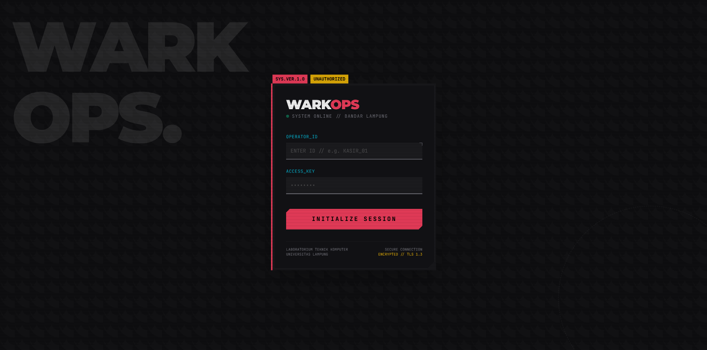
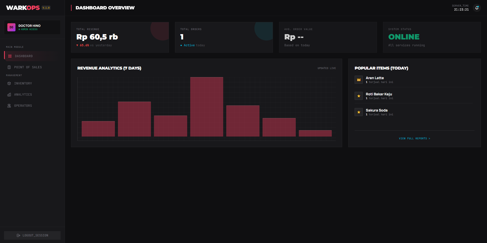
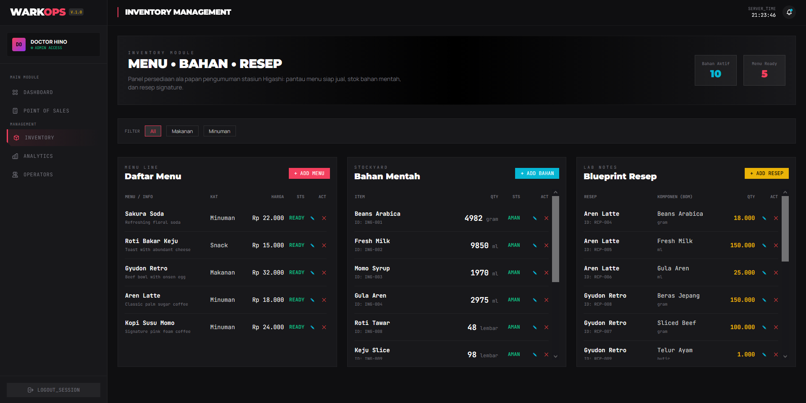
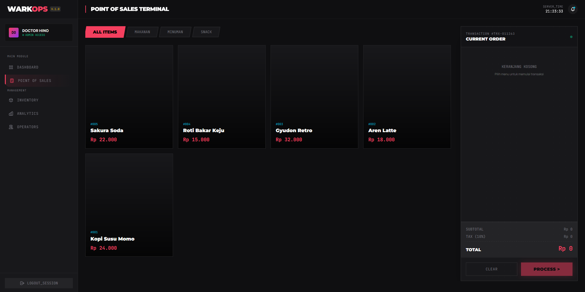
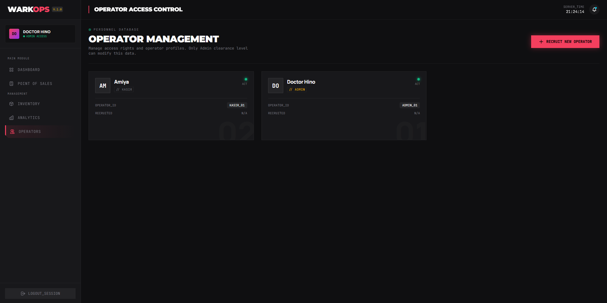
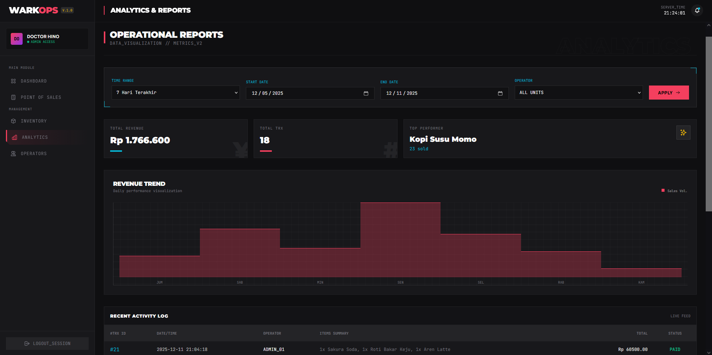

# ☕ WarkOps - Sistem Point of Sale (POS)

**Sistem Point of Sale (POS) Terintegrasi untuk Manajemen Operasional Warkop Berbasis Web**


---

## 👥 Anggota Kelompok 24

| NPM | Nama | Role | Username GitHub |
| :--- | :--- | :--- | :--- |
| **2315061080** | **Galang Pambudi Utama** | **Ketua** | [@hino89](https://github.com/hino89) |
| 2315061013 | Alexander Lawrensius | Anggota | [@Alexander-cloud29](https://github.com/Alexander-cloud29) |
| 2315061074 | Adwika Farsha Ardhan | Anggota | [@starboydingin](https://github.com/starboydingin) |
| 2315061119 | Rendy Antono | Anggota | [@rendyant](https://github.com/rendyant) |

---

## 📖 Deskripsi Project

**WarkOps** (Warkop Operations) adalah aplikasi web manajemen kasir (Point of Sale) yang dirancang khusus untuk membantu UMKM sektor kuliner, khususnya Warung Kopi (Warkop), dalam melakukan transformasi digital.

Aplikasi ini mengusung tema **"Digital Transformation for SMEs"** dengan pendekatan antarmuka yang modern, responsif, dan mengadaptasi gaya visual **Retro-Futurism / Tactical UI** (terinspirasi dari *Arknights* UI Style) untuk memberikan pengalaman pengguna yang unik namun tetap fungsional.

### ✨ Fitur Utama
1.  **Single Page Application (SPA):** Navigasi antar menu (Kasir, Inventory, Laporan) tanpa reload halaman, menggunakan Vanilla JS Router.
2.  **Point of Sale (POS):** Halaman kasir yang interaktif dengan kalkulasi total otomatis.
3.  **Inventory Management:** CRUD (Create, Read, Update, Delete) stok barang secara *real-time*.
4.  **Role-Based Access:** Pembedaan hak akses antara **Admin** (Pemilik) dan **Operator** (Kasir).
5.  **Analytics Dashboard:** Visualisasi data penjualan harian dan barang terlaris.

---

## 🛠️ Arsitektur Teknologi

Sesuai dengan ketentuan praktikum, aplikasi ini dibangun **tanpa framework besar** (No Laravel, No React), namun tetap menggunakan pola arsitektur modern:

* **Frontend:**
    * HTML5 & CSS3 (Tailwind CSS via CDN).
    * **JavaScript Native (ES6+)**: Menangani *Routing*, *State Management*, dan *DOM Manipulation*.
    * **Fetch API**: Komunikasi asinkron dengan Backend.
* **Backend:**
    * **PHP Native (7.4+)**: Bertindak murni sebagai **REST API** (Output JSON).
    * Tidak ada rendering HTML di PHP (Separation of Concerns).
* **Database:**
    * MySQL / MariaDB.
* **Tools:**
    * VS Code, XAMPP, Git.

---

## 🚀 Cara Instalasi & Menjalankan (Installation)

Ikuti langkah-langkah ini untuk menjalankan WarkOps di lokal komputer Anda:

### 1. Persiapan Database
1.  Pastikan **XAMPP** (Apache & MySQL) sudah berjalan.
2.  Buka [phpMyAdmin](http://localhost/phpmyadmin).
3.  Buat database baru dengan nama: `warkops_db`.
4.  Import file SQL yang ada di folder ini: `db.sql`.

### 2. Konfigurasi Koneksi
1.  Buka file `src/api/config.php`.
2.  Pastikan konfigurasi sesuai dengan XAMPP Anda:
    ```php
    define('DB_HOST', 'localhost');
    define('DB_NAME', 'warkops_db');
    define('DB_USER', 'root');
    define('DB_PASS', '');
    define('DB_CHARSET', 'utf8mb4');
    ```

### 3. Menjalankan Aplikasi
1.  Pastikan folder project berada di dalam `htdocs`.
    * Path contoh: `C:/xampp/htdocs/TUBES_PRK_PEMWEB_2025/`
2.  Buka browser dan akses URL berikut:
    ```
    http://localhost/TUBES_PRK_PEMWEB_2025/kelompok/kelompok_24/src/
    ```
    *(Catatan: Browser harus terhubung ke Internet untuk memuat Tailwind CSS via CDN).*

3.  **Login :**
    Untuk login silahkan cek docs/initial_seeding.md atau gunakan docs/seeder.sql

---

## 📸 Screenshots

| Login Page (Retro Style) | Dashboard Utama |
| :---: | :---: |
|  |  |

| Manajemen Inventory | Dashboard POS |
| :---: | :---: |
|  |  |

| Manajemen Users | Laporan Penjualan |
| :---: | :---: |
|  |  |
---

## 📂 Struktur Folder

```text
kelompok_24/
├── db.sql           # File Database SQL
├── erd.jpg                # Diagram Relasi Entitas
├── README.md              # Dokumentasi ini
└── src/
    ├── index.html         # Halaman Login
    ├── dashboard.html     # Shell Utama Aplikasi (SPA Container)
    ├── api/               # Backend PHP (JSON Output)
    │   ├── auth.php
    │   ├── items.php
    │   └── ...
    ├── js/                # Frontend Logic
    │   ├── router.js      # Pengatur Navigasi Halaman
    │   ├── theme.js       # Konfigurasi Tema Tailwind (Warna/Font)
    │   └── ...
    └── views/             # HTML Fragments (Menu-menu)
        ├── home.html
        ├── pos.html
        └── ...